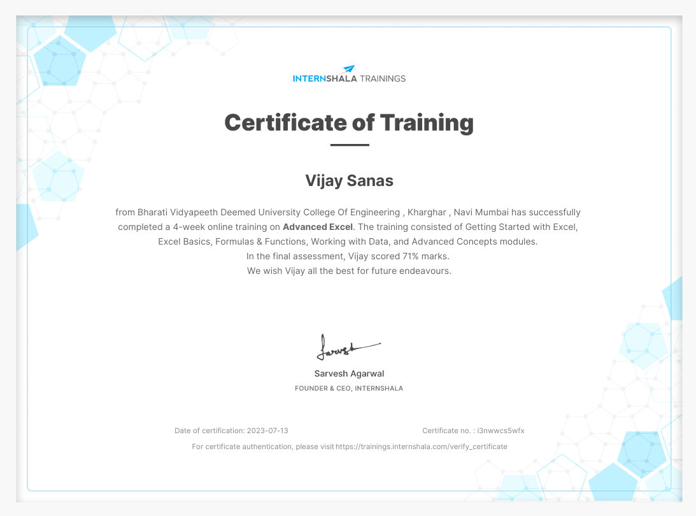

# Advanced-Excel-Certificate_Internshala
---
## Certificate Details

- **Certification**: Advanced Excel
- **Issued By**: Internshala Trainings
- **Institution**: Bharati Vidyapeeth Deemed University College of Engineering, Kharghar, Navi Mumbai
- **Training Duration**: 4 Weeks
- **Modules Covered**:
  - Getting Started with Excel
  - Excel Basics
  - Formulas & Functions
  - Working with Data
  - Advanced Concepts
- **Final Assessment Score**: 71%
- **Date of Certification**: July 13, 2023
- **Certificate Verification**: [Verify here](https://trainings.internshala.com/verify_certificate)

---

## About the Training

This comprehensive course enabled me to gain proficiency in advanced Excel skills that are crucial for data analysis and professional reporting. Below are the key takeaways from this training:
- Efficient handling of large datasets.
- Application of formulas and functions to solve problems.
- Creating dashboards for effective data visualization.
- Advanced skills like pivot tables and automation using Excel tools.

---
